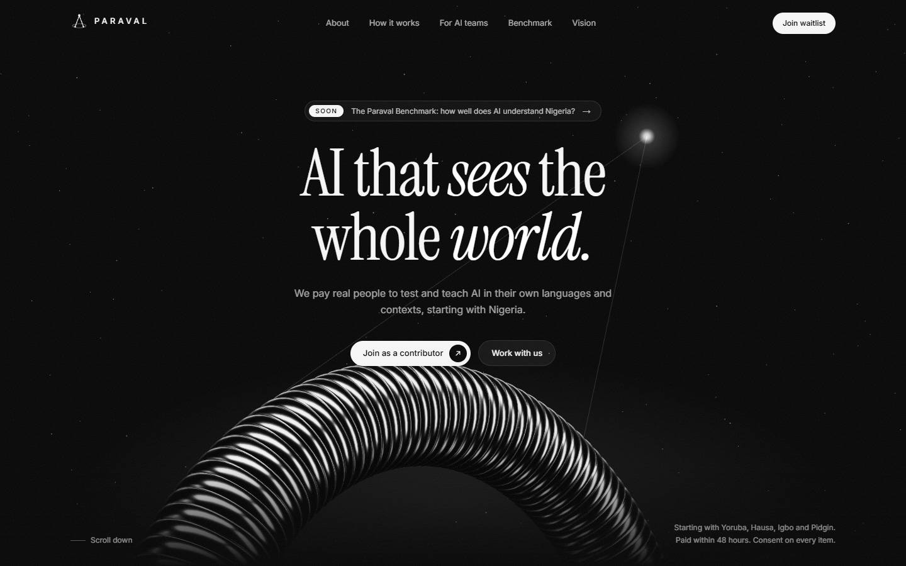
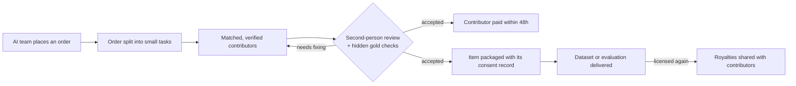
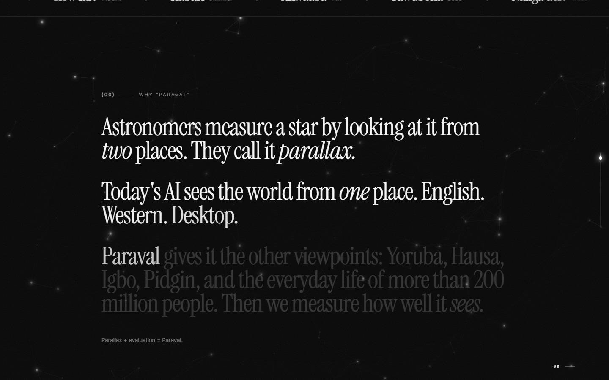
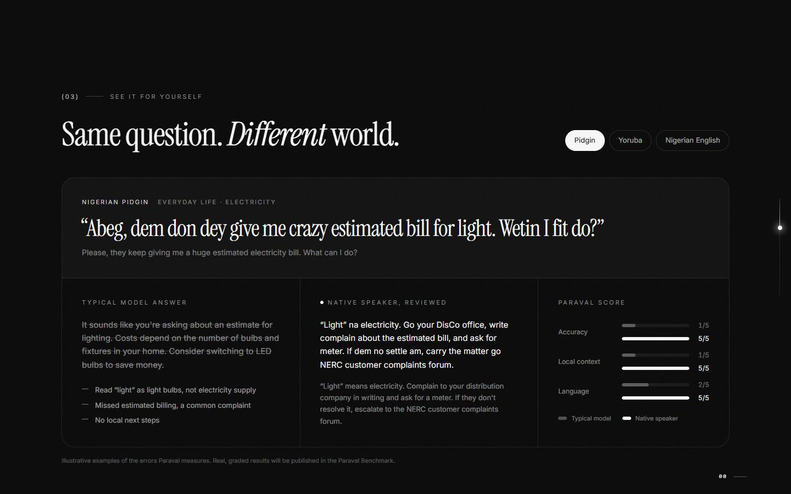
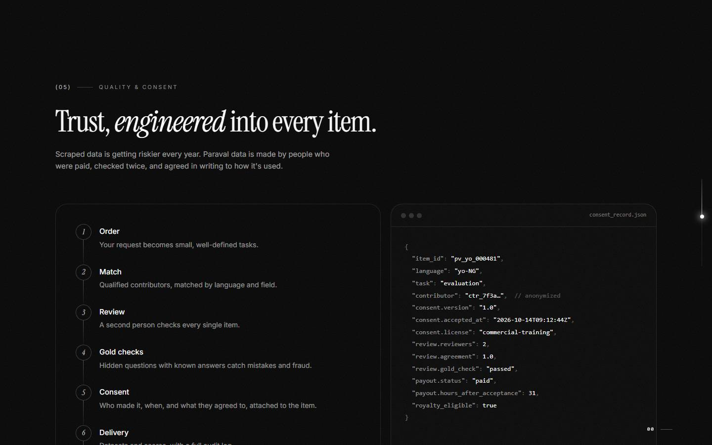
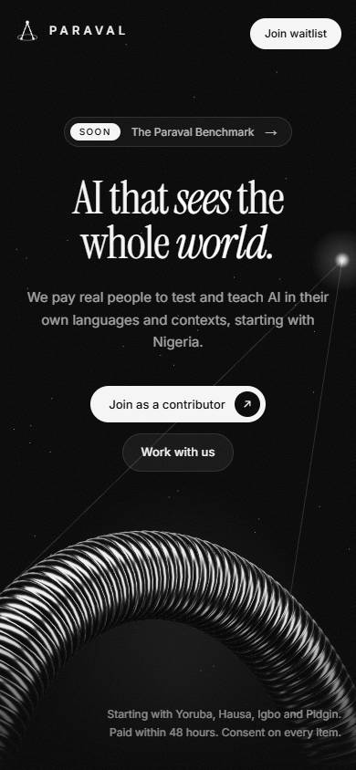

<div align="center">

# PARAVAL

### AI that sees the whole world.

**The human data and evaluation layer for AI in the parts of the world today's models don't understand, starting with Nigeria.**

<br />



<br />

[Our goal](#our-goal) · [The problem](#the-problem) · [Our approach](#our-approach) · [Roadmap](#roadmap) · [This repository](#this-repository) · [Getting started](#getting-started)

</div>

---

## In one sentence

We pay real people, starting with university students, to test and teach AI in their own languages and contexts, and we supply that consented, verified data to the companies building AI.

## Why "Paraval"

**Paraval** blends **parallax** and **evaluation**.

Parallax is how astronomers measure a star: they look at it from two different positions and compare. Today's AI looks at the world from **one** position: English, Western, desktop. Paraval gives it the other viewpoints (Yoruba, Hausa, Igbo, Pidgin and the everyday life of hundreds of millions of people) and **measures how well it sees from each**.

The logo is that parallax diagram: two points on Earth's orbit sight the same star, and their sight lines form a chevron that echoes the **A** in the wordmark.

---

## Our goal

> **Become the default place AI companies go to make their models work for everyone, powered by a global network of millions of contributors who are paid fairly and quickly, and who earn again whenever their work is reused.**

In practice, that means three outcomes:

| For | The outcome |
|---|---|
| **AI companies** | They can finally *measure* how their models perform in underrepresented languages and markets, and get the consented, verified data to *fix* it. |
| **Contributors** | Skilled people (students, graduates and professionals) earn reliable income from their language, field and everyday knowledge, paid within 48 hours, with royalties when their data is relicensed. |
| **The world** | AI that understands the majority of humanity, instead of serving it second-hand answers. |

---

## The problem

AI models are trained mostly on English, Western, internet-heavy data. They fail most of the world's people in ways their makers can't see or measure.

**AI companies…**
- **can't measure what they can't see.** Few trusted tests exist for how a model handles Yoruba, Hausa, Igbo, Pidgin or everyday Nigerian life (electricity bills, POS charges, local law, local medicine).
- **can't easily get the data.** Useful local data is scattered, unlabelled and rarely comes with clear consent.
- **face rising legal risk.** Copyright and data-protection pressure make scraped data risky. Consented, documented data is safer to train on.
- **are growing here.** The next billions of AI users are in Africa, South Asia and Southeast Asia. A model that fails there loses them.

**People…**
- get worse answers than English speakers because AI misunderstands their language, prices, laws and culture.
- often have no reliable way to earn in dollars from home, despite valuable skills.
- have learned to distrust data-work platforms that paid late, cut off whole countries or treated workers as disposable.

**The gap:** AI labs need consented, local, expert human data at scale. Millions of people can produce it and need the income. Nobody has built a trusted, phone-first bridge between the two for this part of the world. **That is Paraval.**

### Why now

1. **Human data is one of AI's fastest-growing markets.** The companies supplying it to AI labs are valued in the tens of billions of dollars, and none of them is built around Africa or underrepresented languages.
2. **The next billion users are here**, exactly where models still fail on language, culture and local systems.
3. **Consent is becoming non-negotiable.** Data with a clean consent trail is worth more every year.
4. **We're built lean.** Modern tools let a small team build infrastructure that once needed hundreds of people. We spend on contributors, not overhead.

---

## Our approach

### 1. The wedge: the Paraval Benchmark

We start by giving something away. **The Paraval Benchmark** is a free, public test set and leaderboard showing how GPT, Claude, Gemini, Llama and other leading models perform on Nigerian languages and everyday life. Every question is written and checked by native speakers.

- It builds **credibility at zero cost**, and it is our proof of quality.
- Every model that scores badly is a **lead** for a private evaluation or a fix-it dataset.
- Every new model release is a reason to **publish fresh scores** and earn attention again.
- Part of the set is public on Hugging Face; a **hidden set stays private** so models can't train on the test.

It is accompanied by **the Paraval Report**, a short, regular write-up of where models fail, shared on X, LinkedIn and Hugging Face.

### 2. What we deliver

Every item is made by paid, verified contributors and carries a consent record.

| Product | What the customer gets | Made by | Launch |
|---|---|---|---|
| **Evaluations** | Scored tests of a model's answers in local languages and contexts, with error reports | Native speakers and students, second-person reviewed | First |
| **Text data** | Local Q&A, translations, instructions and conversations for training | Native speakers, writers, language students | Next |
| **Expert feedback** | Professionals ranking and correcting answers in medicine, law, engineering, agriculture and finance | Final-year students, graduates, professionals | Then |
| **Voice data** | Recorded, transcribed speech in local languages and accents | Contributors on any phone, checked by reviewers | Later |
| **Agent demonstrations** | Screen recordings of people completing real tasks on local apps and websites | Trained contributors, strict privacy rules | Year 2 |

### 3. How it works

A customer's order becomes small tasks. Verified contributors complete them, a second person reviews each one, and every accepted item pays its maker within 48 hours.



**The contributor journey**

1. **Sign up** on a phone with name, email, languages and field of study or work.
2. **Verify** identity and a bank account; students verify with a university email where possible.
3. **Consent** to a plain-language agreement covering what they'll make, who can use it and how royalties work. Acceptance is logged with a timestamp.
4. **Qualify** with a short test for each language or field before paid work unlocks.
5. **Work** from a task queue that shows the pay, time estimate and instructions for each task.
6. **Get reviewed** by at least one other contributor, plus hidden "gold" questions with known answers.
7. **Get paid** to their bank account within 48 hours of acceptance.
8. **Level up**: a quality score unlocks better-paid tasks and reviewer roles.

### 4. Quality, engineered

- **Gold questions:** a share of tasks have known answers. Contributors who miss too many are paused.
- **Agreement checks:** two or three people answer the same item. Disagreements go to a senior reviewer.
- **Spot audits:** a senior reviewer samples finished work every day.
- **Fraud checks:** unusual speed, copy-pasted answers and AI-generated text are flagged.

### 5. Consent by design

Every delivered item carries a record of who made it, when, and what they agreed to. Records are available to customers on request, and names and personal details are stripped from delivered datasets.

```jsonc
{
  "item_id": "pv_yo_000481",
  "language": "yo-NG",
  "task": "evaluation",
  "contributor": "ctr_7f3a…",              // anonymized
  "consent": { "version": "1.0", "accepted_at": "2026-10-14T09:12:44Z", "license": "commercial-training" },
  "review": { "reviewers": 2, "agreement": 1.0, "gold_check": "passed" },
  "payout": { "status": "paid", "hours_after_acceptance": 31 },
  "royalty_eligible": true
}
```

<sub>Sample record for illustration.</sub>

### 6. Our promises

**To contributors**
- Paid to local bank accounts **within 48 hours** of acceptance, only ever from money already received.
- **Royalties**: a share of every relicensing fee, split by accepted items.
- **Published pay rates** and a clear appeal process.
- Treated as partners, not "workers."

**To AI teams**
- Native speakers and domain experts, verified and quality-scored.
- A **consent and audit trail** on every item.
- Specifics and evidence, not claims.

**To everyone**
- A short **transparency report** on payouts and datasets every quarter.
- **We never supply data for surveillance, scams or other harmful uses.** This is written into every customer contract.
- Built to the **Nigeria Data Protection Act 2023** and GDPR-level standards from day one.

---

## Roadmap

### Where we're going

| When | Where | Languages |
|---|---|---|
| **Now** | Nigeria | Yoruba · Hausa · Igbo · Nigerian Pidgin |
| **Next** | Ghana & Kenya | Twi · Swahili · and more |
| **Then** | Across Africa | 2,000+ languages |
| **Later** | South & Southeast Asia | The next billions online |
| **Always** | Every underrepresented language | Wherever AI can't yet see |

### First milestones

- [x] Name, brand direction and company blueprint
- [x] Landing page with contributor and AI-team waitlists (**this repository**)
- [ ] Founding team of 20–50 student contributors across languages and faculties
- [ ] Question format, topics and grading rubric agreed
- [ ] First 250 benchmark questions, each checked by two people
- [ ] Evaluation harness running across leading models
- [ ] 500 questions graded, leaderboard published, dataset on Hugging Face
- [ ] First paid evaluation or data contract

---

## This repository

This repo contains the **Paraval landing page**: the public front door that explains Paraval in seconds and collects the waitlist of contributors and AI teams. It's the first piece of a product that will grow into the benchmark and leaderboard, the contributor app, the customer portal and an internal admin console.

<table>
  <tr>
    <td width="50%"></td>
    <td width="50%"></td>
  </tr>
  <tr>
    <td width="50%"></td>
    <td width="50%" align="center"></td>
  </tr>
</table>

### What's on the page

- **Hero:** a real-time 3D chrome orbit ring (Three.js) with the parallax star, pointer parallax and scroll parallax.
- **Why "Paraval":** the story of the name, lighting up word by word as you scroll over a live constellation.
- **What we do, the problem, and why now**, with public figures on Africa's languages and population.
- **"Same question, different world":** interactive examples of the failures Paraval measures, with scores.
- **How it works**, the **quality pipeline** with a sample consent record, and the **five product lines**.
- **Benchmark teaser** with a sign-up for early results and a blurred leaderboard preview.
- **Roadmap**, **FAQ**, and **two waitlist forms** (contributors and AI teams) saved to Supabase.
- Smooth scrolling, a progress rail, a section readout, blur-in reveals and a greetings ribbon in African languages.

### Tech stack

| Layer | Tool |
|---|---|
| Framework | [Next.js 16](https://nextjs.org) (App Router, Server Actions) + TypeScript |
| Styling | [Tailwind CSS v4](https://tailwindcss.com) |
| 3D | [Three.js](https://threejs.org), lazy-loaded after the page is interactive |
| Smooth scrolling | [Lenis](https://lenis.darkroom.engineering) |
| Database | [Supabase](https://supabase.com) (Postgres with row-level security) |
| Hosting | [Vercel](https://vercel.com) |
| Fonts | Instrument Serif + Inter via `next/font` (self-hosted) |

### Project structure

```
src/
├── app/
│   ├── actions.ts             # Server actions: validate and save waitlist sign-ups
│   ├── layout.tsx             # Fonts, metadata, global effects
│   ├── page.tsx               # The landing page, section by section
│   ├── opengraph-image.tsx    # Share card for WhatsApp, X and LinkedIn
│   ├── privacy/ · terms/      # Draft legal pages
│   └── robots.ts · sitemap.ts
├── components/
│   ├── hero/                  # Three.js orbit scene (lazy-loaded)
│   ├── sections/              # One file per page section
│   ├── forms/                 # Contributor and AI-team forms
│   ├── ui/                    # Adapted 21st.dev components
│   ├── ScrollFx.tsx           # Lenis, progress rail, section readout
│   └── Logo.tsx               # The parallax mark
└── lib/
    ├── options.ts             # Allowed form values (mirrors DB constraints)
    ├── site.ts                # Site URL, contact email, social links
    └── supabase.ts            # Server-only Supabase client
```

---

## Getting started

**Requirements:** Node.js 20+ and npm.

```bash
git clone https://github.com/adeyanjufuhad/paraval.git
cd paraval
npm install
cp .env.example .env.local   # then fill in the values below
npm run dev                  # http://localhost:3000
```

| Script | What it does |
|---|---|
| `npm run dev` | Start the development server |
| `npm run build` | Production build |
| `npm run start` | Serve the production build |
| `npm run lint` | Lint with ESLint |

### Environment variables

| Name | Required | Description |
|---|---|---|
| `SUPABASE_URL` | Yes | Your Supabase project URL |
| `SUPABASE_PUBLISHABLE_KEY` | Yes | The project's **publishable** key. It is safe to expose, because row-level security only allows inserts. |
| `NEXT_PUBLIC_SITE_URL` | No | Custom domain, once there is one. On Vercel, the production URL is detected automatically. |

Never commit `.env.local`, and never use the Supabase **secret/service-role** key in this app.

### Database

Three tables, one per form:

| Table | Stores |
|---|---|
| `contributor_waitlist` | Name, email, languages, status (student/graduate/professional), institution, field, country, referral source |
| `company_waitlist` | Name, work email, organization, role, organization type, needs, languages or markets, scale, message, country |
| `benchmark_updates` | Email, for early benchmark results |

**Security model:** row-level security is enabled on every table. The public role may **only insert**; it cannot read, update or delete anything. Emails are unique (case-insensitive), and the database enforces field lengths and allowed values as check constraints. Server-side validation in `src/app/actions.ts` mirrors those rules, and a hidden honeypot field filters out bots.

> When you change an allowed value in `src/lib/options.ts`, update the matching database constraint too.

To view sign-ups, use the Supabase dashboard (Table Editor), where access is limited to the Paraval team.

### Deployment

The site deploys on **Vercel** from this repository:

1. Import the repo at [vercel.com/new](https://vercel.com/new).
2. Add `SUPABASE_URL` and `SUPABASE_PUBLISHABLE_KEY` as environment variables.
3. Deploy. Every push to `master` redeploys the production site automatically.

### Design system

| Role | Color |
|---|---|
| Background | Deep black `#050505` |
| Surfaces, lines | Graphite `#2A2A2A` |
| Secondary text | Grey `#8A8A8A` |
| Main text, logo | Off-white `#F5F5F5` |

- **Type:** Instrument Serif for headlines (italic for emphasis), Inter for body text.
- **Motifs:** thin orbit lines, constellations, a single bright star, film grain and lots of black space. No clip-art robots.
- **Voice:** clear, confident, warm. Contributors are partners, not "workers." AI teams get specifics and evidence.

### Performance and accessibility

- About **540 KB** compressed in total (target: under 1 MB for slow networks). The 3D scene loads only after the page is usable.
- Mobile-first layout, tested down to 375 px wide.
- Honors **reduced motion**: animations, smooth scrolling and the 3D scene hold still.
- Semantic landmarks, labelled form fields, keyboard-friendly tabs and FAQ, and visible focus states.

### Credits

- [Gravity Stars](https://21st.dev/@educalvolpz/components/gravity-stars) by educalvolpz and [Reading Text Reveal](https://21st.dev/@waleedkibhen/components/reading-text-reveal) by waleedkibhen, from [21st.dev](https://21st.dev), both adapted for Paraval.
- [Three.js](https://threejs.org), [Lenis](https://lenis.darkroom.engineering), [Instrument Serif](https://fonts.google.com/specimen/Instrument+Serif) and [Inter](https://rsms.me/inter/).

---

<div align="center">

**Every language. Every viewpoint.**

© 2026 Paraval. All rights reserved.

</div>
